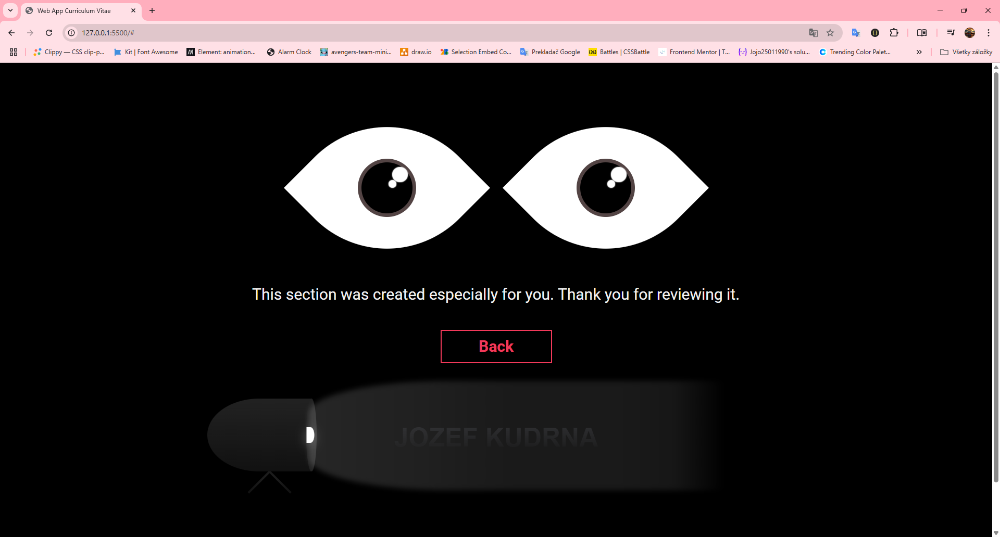

# Web App CV

- Whole project is basically a showcase of my work for you.

- Css Art
- Gsap & Keyframes ( css / scss ) Animations and Effects
- Fully Responsive

# Features

- Eyes movement following text ( animation )
- Pencil Animation: teleport, and writes the name.
- Whole CV is animated theoretically 🤣
- This is not a feature, but this project shows what I love ❤️

# Screenshot

## Desktop Screens

- Main
  

- Why me  
   

- About me
  

- Eyes
  

## Mobile Screens

- Main

  

- Why me

  

- About me

  

- Eyes

  

# Build with

- Semantic HTML5 markup
- SCSS - BEM
- Desktop-first workflow
- Vanilla js
- Gsap

# Author

- Frontend Mentor - [Jojo25011990](https://www.frontendmentor.io/profile/Jojo25011990)
- Instagram - [web.animations.and.effects](https://www.instagram.com/web.animations.and.effects)
- Tiktok - [web.anim.and.effects](https://www.tiktok.com/@web.anim.and.effects)
- Youtube - [web.animations.and.effects](https://www.youtube.com/@web.animations.and.effects)
- Linkedin - [Jozef Kudrna](https://www.linkedin.com/in/jozef-kudrna-28b580295)
